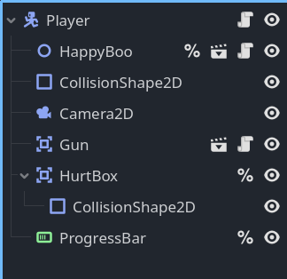
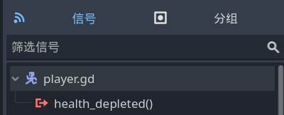
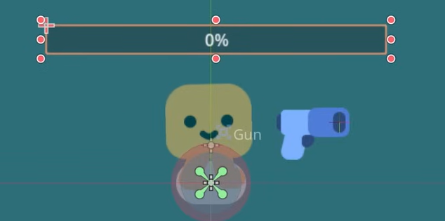
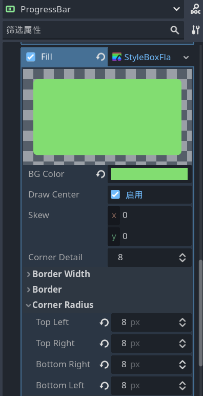
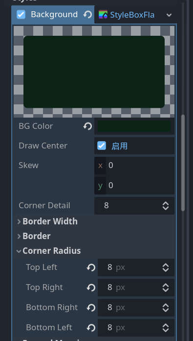
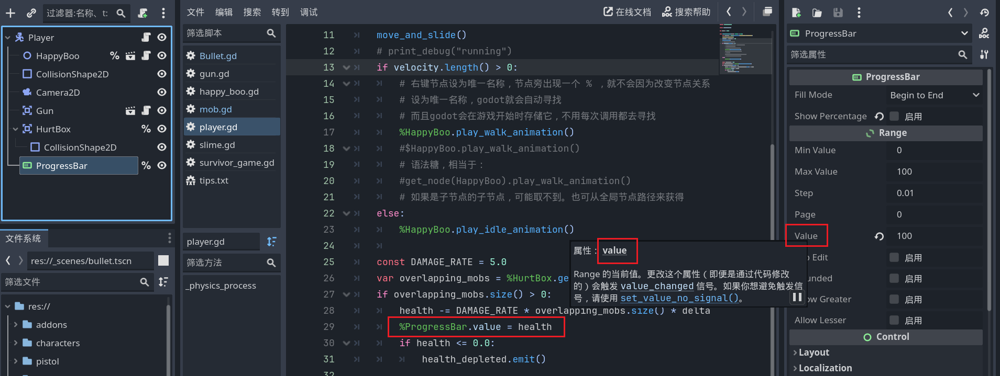

# 给玩家加血条

- 在 `Player` 场景根节点下添加一个 `Area2D` 子节点，重命名“HurtBox”， `Layer` 全部取消勾选， `Mask` 勾选 `2` ，检测敌人。

> 可以看出，这里的物理体积碰撞箱和伤害检测碰撞箱是分开的

- 为 `HurtBox` 添加 `CollisionShape2D` 子节点，设置 `Shape` 例如 `circleShape2d` ,可以更改颜色。并将 `HurtBox` 设置 **唯一名称** 。



- 编写脚本 `Player.gd` ，为玩家添加血量，并受伤。当血量小于等于0时发出自定义的信号：

```gdscript

var health = 100.0

signal health_depleted

func _physics_process(delta: float) -> void:
	const DAMAGE_RATE = 5.0 # 帧伤？
	var overlapping_mobs = %HurtBox.get_overlapping_bodies()
	if overlapping_mobs.size() > 0:
		health -= DAMAGE_RATE * overlapping_mobs.size() * delta
		#%ProgressBar.value = health
		if health <= 0.0:
			health_depleted.emit()
```



## 血条UI

- 为 `Player.tscn` 场景的根节点添加一个 `ProgressBar` 子节点作为血条。



- 在 `ProgressBar` 的检查器中禁用 `Show Percentage` 。

- 常用的属性： `min value` 、 `max value` 、`step` 、 `value` 。

- 在 **control-theme overrides-styles** 中勾选 `Fill` ，选择 **New styleBoxFlat** ，进行简单地改动：



- 勾选 `Background` ，选择 **New styleBoxFlat** ，同样地调整颜色和边角：



> alt或者shift能帮助你更好地调整血条UI的样子

- 将 `ProgressBar` 节点设为唯一名称，并用代码控制它的属性 `value` ：

```gdscript
func _physics_process(delta: float) -> void:
	const DAMAGE_RATE = 5.0
	var overlapping_mobs = %HurtBox.get_overlapping_bodies()
	if overlapping_mobs.size() > 0:
		health -= DAMAGE_RATE * overlapping_mobs.size() * delta
		# 新增了下面这一行代码
		%ProgressBar.value = health
		if health <= 0.0:
			health_depleted.emit()
```

