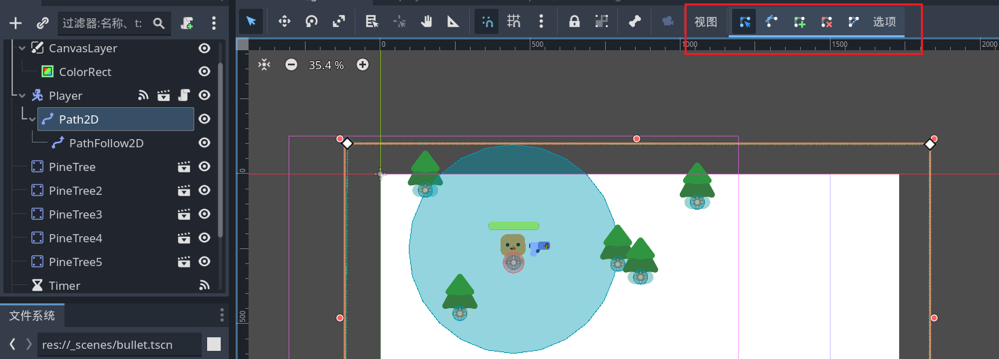

# 在玩家周围随机生成敌人

- 新建一个 `Path2D` 节点，如果放在根节点 `Game` 下就不会变动，放在 `Player` 节点下才会随着 `Player` 的移动而移动。

- 使用 **添加点** 以添加4个点；并使用 **闭合曲线** ； **选择顶点** 可以调整点的位置。



- 为 `Path2D` 添加一个 `PathFollow2D` 子节点。

- 在 `Path2D` 的线上会出现一个点，改变 `PathFollow2D` 检查器中的 `Progress` 和 `Progress Ratio` 属性可以看到点是怎样移动的。

- 将 `PathFollow2D` 设为唯一名称，并为 `Game` 场景的根节点添加并编写脚本：

```gdscript
extends Node2D

func _ready() -> void:
	# 随便生几只试一下
	spawn_mob()
	spawn_mob()
	spawn_mob()
	spawn_mob()

func spawn_mob():
	var new_mob = preload("res://_scenes/mob.tscn").instantiate()
	# randf() 返回0到1之间的一个随机数？
	$Player/Path2D/PathFollow2D.progress_ratio = randf()
	new_mob.global_position = $Player/Path2D/PathFollow2D.global_position
	add_child(new_mob)
```

> 通过代码生成的怪物在本地节点树看不到，要运行场景后在远程树里才能看到。

## 设置计时器来定时生成敌人

- 在 `Game` 场景的根节点下添加一个 `Timer` 子节点。设置 `Wait Time` ，启用 `Autostart` 。

- 将 `time_out` 信号连接到根节点 `Game` 。

```gdscript
func _on_timer_timeout() -> void:
	spawn_mob()	
```