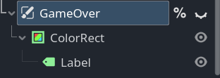
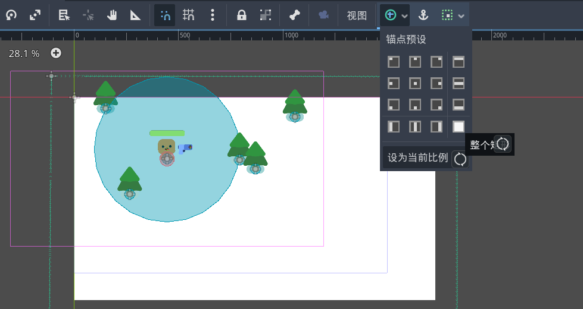
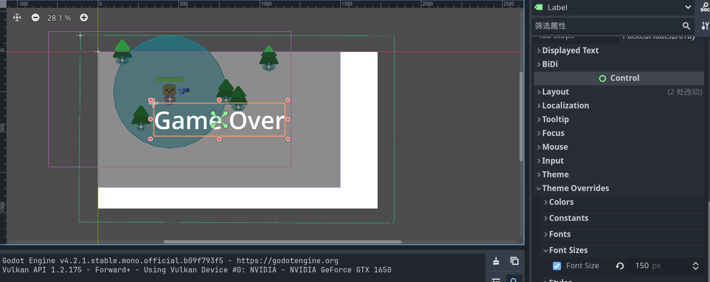
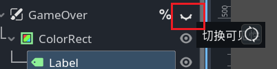
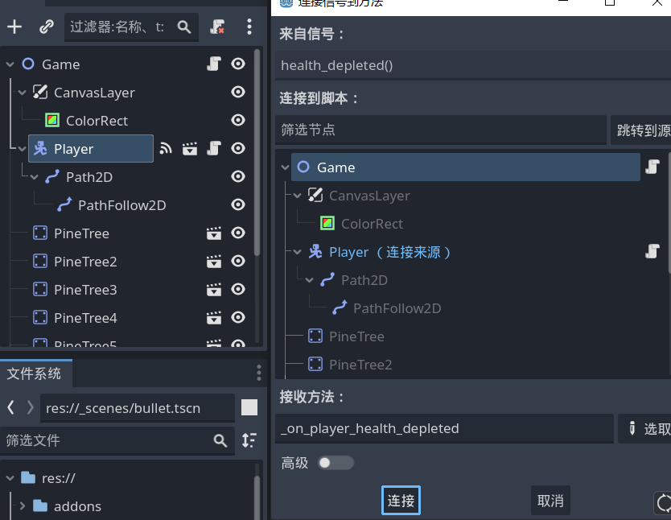

# Game Over

- 选中 `Game` 根节点，添加 `CanvasLayer` 子节点，重命名“GameOver”。

- 添加 `colorRect` 子节点，为其添加 `Label` 子节点。



- 在检查器中调整 `ColorRect` 的颜色，透明度等。

- 设置 `ColorRect` 整个矩形。
  


- 填写 `Label` 的 `Text` ，并将 **锚点预设** 为 **居中** ，这个是相对父节点即 `ColorRect` 设置的，但是父节点已经是整个矩形占满了，所以相当于屏幕中心。

- 改变字体大小：



### 节点、信号、脚本

- 游戏没结束时隐藏UI，结束再显示游戏结束的UI



- 将 `GameOver` 节点设为唯一名称。

- 将 `Player` 节点发出的 `healthDeplete` 信号连接到 `Game` 场景根节点。



- 修改 `Game.gd` :

```gdscript
func _on_player_health_depleted() -> void:
	%GameOver.visible = true
	# 取得场景树？
	get_tree().paused = true
```

- 在Godot引擎内，游戏结束后，按 F8 和 F5 重新运行场景。
