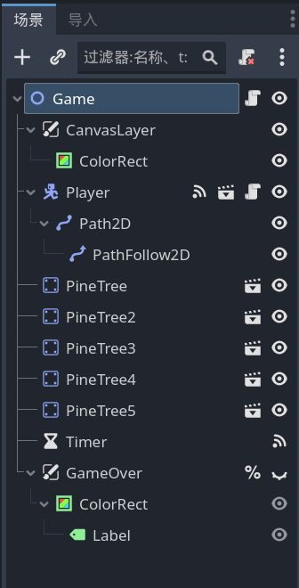
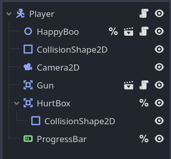
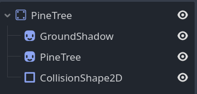
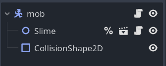
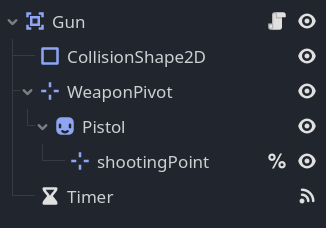
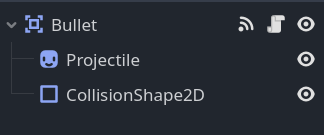
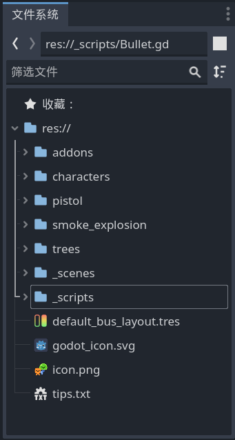

# 附录：场景树及完整脚本

教程到这里就结束了，完结撒花！

---

### survivor_game （主场景）

#### survivor_game.tscn



#### survivor_game.gd

```gdscript
extends Node2D

func _ready() -> void:
	# 通过代码生成的怪物在本地节点树看不到，要运行场景后在远程树里才能看到
	spawn_mob()
	spawn_mob()
	spawn_mob()
	spawn_mob()	

func spawn_mob():
	var new_mob = preload("res://_scenes/mob.tscn").instantiate()
	# randf() 返回0到1之间的一个随机数？
	$Player/Path2D/PathFollow2D.progress_ratio = randf()
	new_mob.global_position = $Player/Path2D/PathFollow2D.global_position
	add_child(new_mob)


func _on_timer_timeout() -> void:
	spawn_mob()	


func _on_player_health_depleted() -> void:
	%GameOver.visible = true
	# 取得场景树？
	get_tree().paused = true
```

### Player

#### Player.tscn



#### Player.gd

```gdscript
extends CharacterBody2D

signal health_depleted

var health = 100.0

func _physics_process(delta: float) -> void:
	var direction = Input.get_vector("move_left","move_right",
	"move_up","move_down")
	velocity = direction * 600
	move_and_slide()
	# print_debug("running")
	if velocity.length() > 0:
		# 右键节点设为唯一名称，节点旁出现一个 % ，就不会因为改变节点关系而报错
		# 设为唯一名称，godot就会自动寻找
		# 而且godot会在游戏开始时存储它，不用每次调用都去寻找
		%HappyBoo.play_walk_animation()
		#$HappyBoo.play_walk_animation()
		# 语法糖，相当于：
		#get_node(HappyBoo).play_walk_animation()
		# 如果是子节点的子节点，可能取不到。也可从全局节点路径来获得
	else:
		%HappyBoo.play_idle_animation()
		
	const DAMAGE_RATE = 5.0
	var overlapping_mobs = %HurtBox.get_overlapping_bodies()
	if overlapping_mobs.size() > 0:
		health -= DAMAGE_RATE * overlapping_mobs.size() * delta
		%ProgressBar.value = health
		if health <= 0.0:
			health_depleted.emit()
```

### pine_tree

#### pine_tree.tscn



### mob （敌人）

#### mob.tscn



#### mob.gd

```gdscript
extends CharacterBody2D

var health = 3

'''
# 运行场景后可在左侧看到远程和本地，远程应该就是全局节点的排列了
# godot在创建节点前就运行了脚本，因此这里拿不到player节点，会报错
# 要用_ready()函数
# 下面一行为错误示范
#var player = get_node("/root/Game/Player")
# 下面两行为正确示范
#var player
#func _ready() -> void:
#	player = get_node("/root/Game/Player") # 好像区分大小写
'''
# 语法糖，相当于上面那一段
@onready var player = get_node("/root/Game/Player")

func _ready() -> void:
	%Slime.play_walk()

func _physics_process(delta: float) -> void:
	var direction = global_position.direction_to(player.global_position)
	velocity = direction * 300.0
	move_and_slide()

func take_damage():
	health -= 1
	%Slime.play_hurt()
	
	if health == 0:
		queue_free()
		
		const SMOKE_SCENE = preload("res://smoke_explosion/smoke_explosion.tscn")
		var smoke = SMOKE_SCENE.instantiate()
		get_parent().add_child(smoke)
		# 这里的 global_position 没说，应该就是父节点的吧，难不成是根节点？
		smoke.global_position = global_position
```

### Gun

#### Gun.tscn



#### Gun.gd

```gdscript
extends Area2D


func _physics_process(delta: float) -> void:
	# get_overlapping_bodies()方法属于Area2D，将检测进入其范围的实体，并返回数组
	var enemies_in_range = get_overlapping_bodies()
	if enemies_in_range.size() > 0:
		#var target_enemy = enemies_in_range[0]
		var target_enemy = enemies_in_range.front()
		look_at(target_enemy.global_position)
		# 好像不能攻击距离玩家最近的怪，而是攻击第一个进范围的怪
		# 枪初始位置在右边，但转到左侧后枪就倒过来了


func shoot():
	# 在文件夹中把文件拖进来即可显示路径
	# preload()是游戏开始就加载，load()是运行到这行代码再加载
	const BULLET = preload("res://_scenes/bullet.tscn")
	# 实例化
	var new_bullet = BULLET.instantiate()
	# 设置子弹的位置和朝向，从枪口射出
	# position相对于父节点，global_position是相对于root节点了
	# 记得将 shootingPoint 节点设为唯一名称
	new_bullet.global_position = %shootingPoint.global_position
	new_bullet.global_rotation = %shootingPoint.global_rotation	
	%shootingPoint.add_child(new_bullet)

func _on_timer_timeout() -> void:
	shoot()
```

### Bullet

#### Bullet.tscn



#### Bullet.gd

```gdscript
extends Area2D

var travelled_distance = 0

func _physics_process(delta: float) -> void:
	const SPEED = 1000
	const RANGE = 1200
	
	# 让子弹往前直射
	# 在主工作区中旋转子弹，也会往前射
	var direction = Vector2.RIGHT.rotated(rotation)
	position += direction * SPEED * delta
	
	# 移动1200像素后销毁
	travelled_distance += SPEED * delta
	if travelled_distance > RANGE:
		queue_free()


func _on_body_entered(body: Node2D) -> void:
	queue_free()
	if body.has_method("take_damage"):
		body.take_damage()
```

### 文件系统



## 完