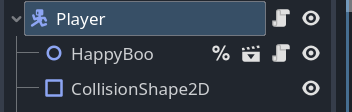

# 创建玩家角色

> 快捷键 ctrl+A 呼出添加节点窗口

- 新建一个 `characterbody2d` 节点，重命名为“Player”。

- 为其添加 `happyboo.tscn` 子节点（人物动画，这个场景文件在素材里）。

- 添加 `collisionshape2d` 子节点，在右侧检查器中选择 `shape` ，例如 `circleshape2d` 并调整。



- 给 `player` 节点添加脚本。控制人物移动的脚本：

```gdscript
extends CharacterBody2D

func _physics_process(delta: float) -> void:
	var direction = Input.get_vector("move_left","move_right",
	"move_up","move_down")
	velocity = direction * 600
	move_and_slide()
```

- 取得子节点并使用子节点的方法播放动画：

> 右键节点设为唯一名称，节点旁出现一个 % ，就不会因为改变节点关系而报错
> 设为唯一名称，godot就会自动寻找
> 而且godot会在游戏开始时存储它，不用每次调用都去寻找
> 代码使用如下：
> %HappyBoo.play_walk_animation()

```gdscript
func _physics_process(delta: float) -> void:
	if velocity.length() > 0:
		%HappyBoo.play_walk_animation()
		#$HappyBoo.play_walk_animation() # 语法糖，相当于下面这句：
		#get_node(HappyBoo).play_walk_animation()
        # 如果是子节点的子节点，可能取不到。也可从全局节点路径来获得
	else:
		%HappyBoo.play_idle_animation()
```
> ctrl+D 选择同样的代码

- 保存场景。