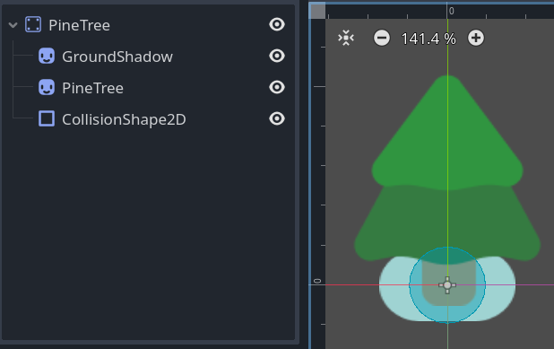
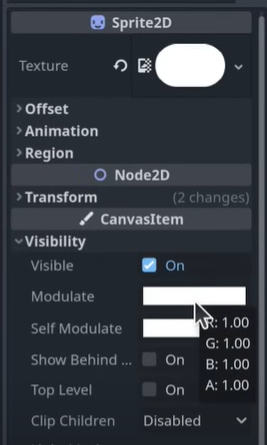
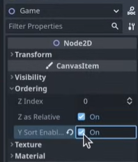

# 游戏场景

- 新建场景，添加 `node2d` ，重命名 “Game”。

- 把 `player` 节点拖入主工作区（区分大小写），设为子节点。

- 添加子节点 `colorrect` 作为简单背景，注意图层顺序由节点顺序决定。

- 保存为主场景，可在 **项目管理** 中更改主场景。

## 树木

- 新建场景，选择 `StaticBody2D` 为场景根节点，
 
- 为其添加 `collisionshape2d` 子节点，检查器选择 `circleshape` ，放入精灵后调整大小。

- 将文件夹中的 `PineTree.png` 拖入主工作区，变成根节点的子节点，且为 `sprite2d` 。

> 文件系统中可直接搜索需要的文件名

- 为树添加阴影，添加 `GroundShadow.png` 为根节点的子节点，调整位置。

- 阴影设置为白色，方便更改颜色。

- 保存场景。

-做好后可以在 Game 场景中拖入树木了。

## 人物与树木的遮挡关系

- 选择场景根节点 `Game` ，在 `CanvasItem` 中勾选 `y sort enable` 来解决人物始终在树的上方的问题。

- （问题：树木的阴影也会遮挡人物，但树木的阴影应始终在人物下面）