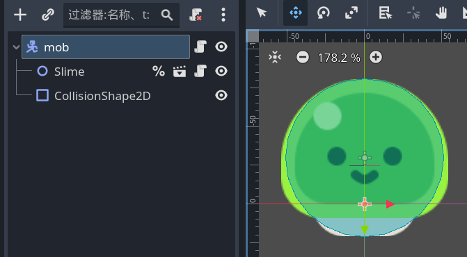
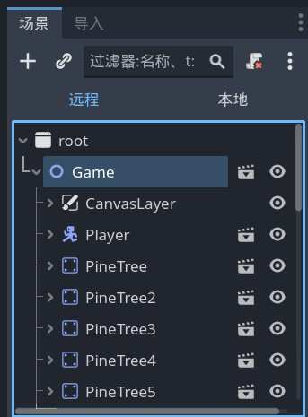

# 创建敌人

- 新建场景，根节点为 `characterbody2d` ，重命名为“mob”。

- 拖入 `Slime.tscn` （动画）作为子节点。

- 添加 `collisionshape2d` 子节点，`shape` 可选 `circleshape` 。



- 为根节点添加脚本 `mob.gd` ,并使敌人追踪玩家。

```gdscript
extends CharacterBody2D

# godot在创建节点前就运行了脚本，因此这里拿不到player节点，会报错
# 要用_ready()函数
# 错误用法如下所示
#var player = get_node("/root/Game/Player")

# 正确用法如下所示
#var player
#func _ready() -> void:
#	player = get_node("/root/Game/Player") # 好像区分大小写

# 语法糖，相当于上面那一段
@onready var player = get_node("/root/Game/Player")

func _physics_process(delta: float) -> void:
	var direction = global_position.direction_to(player.global_position)
	velocity = direction * 300.0
	move_and_slide()
```

> 运行场景后可在左侧看到远程和本地，远程应该就是全局节点的排列了
> 

- 把敌人场景拖入游戏场景后试着运行一下。

- 问题：`@onready var player = get_node("/root/Game/Player")` 很不稳定，如果 `Player` 节点不是 `Game` 的子节点就会报错。