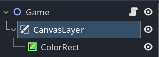
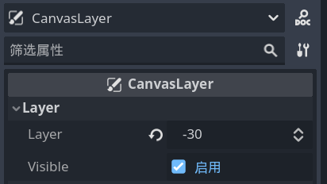

# 跟随玩家的相机

- 为 `Player` 场景的根节点添加 `camera2d` 子节点。

- 问题：相机会照到非背景区。

- 为 `Game` 场景的根节点添加 `CanvasLayer` 子节点。并将 `colorRect` 设为它的子节点。

- 在 `CanvasLayer` 中改变渲染顺序，`Layer` 改为例如 `-30` 。使得背景在玩家和敌人场景的下面。

- （分辨率自己改）