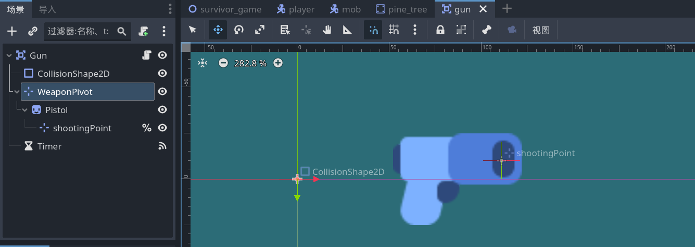
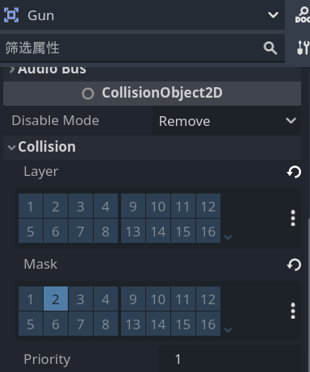

# 创建武器：小手枪

- 新建场景，根节点设置为 `Area2D` ，重命名为“Gun”。

- 添加 `CollisionShape2d` 为子节点， `Shape` 设置为 `CircleShape` ，这是武器的范围（移动还是攻击？），the range of gun。

- 添加 `pistol.png` 为根节点的 `sprite2D` 类型的子节点。

- 添加 `Marker2D` 节点为 `Gun` 的子节点，重命名为 “WeaponPivot”，并将 `pistol` 设为子节点。

> 旋转 `WeaponPivot` 节点时， `pistol` 子节点会以 `WeaponPivot` 为圆心进行旋转。

- 为 `pistol` 添加一个 `Marker2D` 子节点，重命名为“shootingPoint”，并拖动到枪口上。



<center>蓝色部分是 collisionShape2D </center>

- 保存场景

> ctrl+shift+o 快速打开场景

- 为 `Player` 场景的根节点添加 `Gun` 场景作为子节点，并调整到合适的位置。

- 如果枪的精灵离角色太远，就回到 `Gun` 场景调整 `pistol` 这个 `Sprite2D` 节点相对父节点的位置并保存。

- 为 `Gun` 场景的根节点添加脚本。

```gdscript
extends Area2D

func _physics_process(delta: float) -> void:
	# get_overlapping_bodies()方法属于Area2D，将检测进入其范围的实体，并返回数组
	var enemies_in_range = get_overlapping_bodies()
	if enemies_in_range.size() > 0:
		#var target_enemy = enemies_in_range[0]
		var target_enemy = enemies_in_range.front()
		look_at(target_enemy.global_position)
		# 好像不能攻击距离玩家最近的怪，而是攻击第一个进范围的怪
    	# 枪初始位置在右边，但转到左侧后枪就倒过来了
```

## Layer and Mask

- 问题：运行场景后发现，小手枪不动了。那是因为 `enemies_in_range` 这个数组第一个是玩家，所以手枪一直指着玩家。

- 选择 `Gun` 场景的根节点 `Gun` (Area2D),在检查器中找到 `Layer` 和 `Mask` 。

- `Gun` 的 `Layer` 表示什么可以检测到 `Gun` 。

> `Gun` 的 `Layer` 在 `1` ，表示任何一个 `Mask` 在 `1` 的东西都能检测到 `Gun`

- `Gun` 的 `Mask` 表示 `Gun` 可以检测到什么。

>  `Gun` 的 `Mask` 在 `1` ,表示 `Gun` 能检测到一切 `Layer` 在 `1` 的东西



- 将 `Gun` 的 `Layer` 取消勾选， `Mask` 勾选 `2` 。同时，在 `mob` 场景的根节点 `mob` 中， `Layer` 勾选 `2` （能被 `Gun` 检测到）； `Mask` 勾选 `1` 和 `2` （能检测到 `1` 的玩家和树，以及同为 `2` 的其他敌人）。
