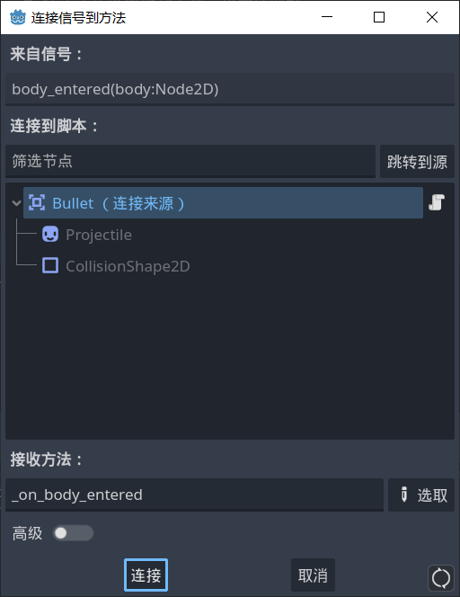

# 创建子弹

- 新建场景，设置根节点为 `Area2D` ，重命名为“Bullet”。

- 添加 `CollisionShape2D` 为子节点，设置 `circleShape` 。

- 添加 `projectile.png` 为根节点的 `Sprite2D` 类型的子节点。


- 根节点 `Bullet` 的 `Layer` 全部取消勾选， `Mask` 勾选 `1` 和 `2` ，为了检测敌人和树木。如果想让子弹穿过树木就取消勾选 `1` 。

- 为 `Bullet` 根节点添加脚本。想让子弹“直线”射出，需要考虑旋转角度。

```gdscript
extends Area2D

func _physics_process(delta: float) -> void:
	const SPEED = 1000
	# 让子弹往前直射
	# 在主工作区中旋转子弹，也会往前射
	var direction = Vector2.RIGHT.rotated(rotation)
	position += direction * SPEED * delta
```

- 编写脚本，让子弹射出一定距离后自动销毁。

```gdscript
extends Area2D

var travelled_distance = 0

func _physics_process(delta: float) -> void:
	const SPEED = 1000
	const RANGE = 1200
	
	var direction = Vector2.RIGHT.rotated(rotation)
	position += direction * SPEED * delta
	
	# 移动1200像素后销毁
	travelled_distance += SPEED * delta
	if travelled_distance > RANGE:
		queue_free()
```

## 信号 signal ：让子弹能够伤害敌人

- 选择 `Bullet` 场景根节点，在右侧信号中选择 **body_entered** 并连接到自己。




- 代码如下：

```gdscript
func _on_body_entered(body: Node2D) -> void:
	queue_free()
	if body.has_method("take_damage"):
		body.take_damage()
```

### 修改 mob 脚本

- 在敌人 `mob` 场景的根节点脚本 `mob.gd` 修改：

```gdscript
···
var health = 3
···
func take_damage():
	health -= 1
	%Slime.play_hurt()
	
	if health == 0:
		queue_free()
```
