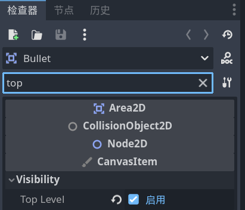

# 让武器射出子弹

- 在 `Gun.gd` （ `Gun` 场景根节点的脚本）中添加方法来让小手枪射出子弹：

```gdscript
func shoot():
	# 在文件夹中把文件拖进来即可显示路径
	# preload()是游戏开始就加载，load()是运行到这行代码再加载
	const BULLET = preload("res://_scenes/bullet.tscn")
	# 实例化
	var new_bullet = BULLET.instantiate()
	# 设置子弹的位置和朝向，从枪口射出
	# position相对于父节点，global_position是相对于root节点了
	# 记得将 shootingPoint 节点设为唯一名称
	new_bullet.global_position = %shootingPoint.global_position
	new_bullet.global_rotation = %shootingPoint.global_rotation	
	%shootingPoint.add_child(new_bullet)
```

## 自动攻击以及攻击频率

- 为 `Gun` 场景的根节点添加 `Timer` 子节点。

- 在 `Timer` 检查器中更改 `Wait Time` 例如 `0.3` s，并勾选 `Autostart` 。

- 将计时器的信号连接到根节点 `Gun` 。并编写代码：


```gdscript
func _on_timer_timeout() -> void:
	shoot()
```

## 修复BUG：子弹从奇怪的位置射出

- 问题：此时会看到子弹从奇怪的位置出现，原因在于节点 `position` 的运行机制。当创建一个子弹场景 `Bullet` 时，它是作为 `shootingPoint` 的子节点引入的。当我们设置了子弹的 `global_position` 时，它和父节点 `shootingPoint` 抵消了，旋转也是如此。

> "When we set its(Bullet) global position to that of the shooting point it gets offset. Also when we rotate the gun, all the bullet we shoot are rotating with it at an offset."

回到 `Bullet` 场景，在根节点的检查器中搜索 `Top Level` 并勾选。这样子弹就会独立于它的父节点来计算位置（？）。

